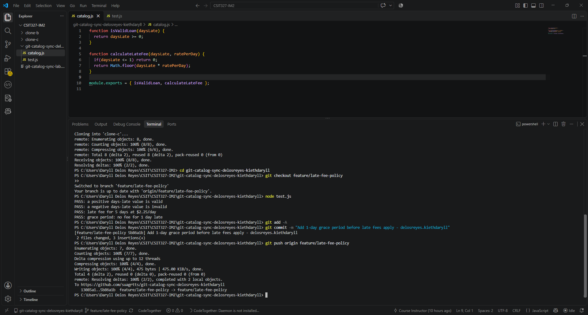
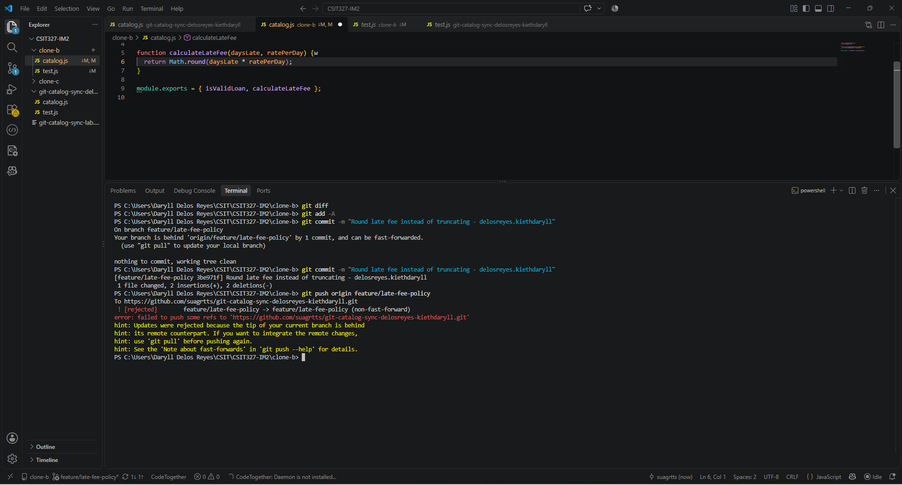
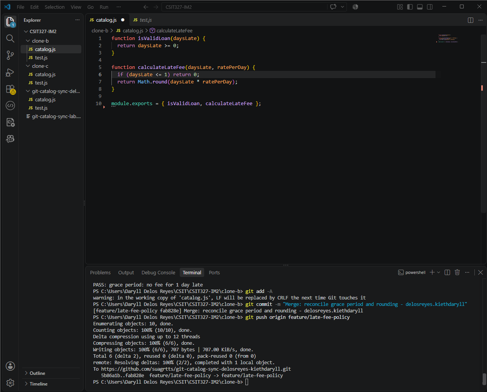
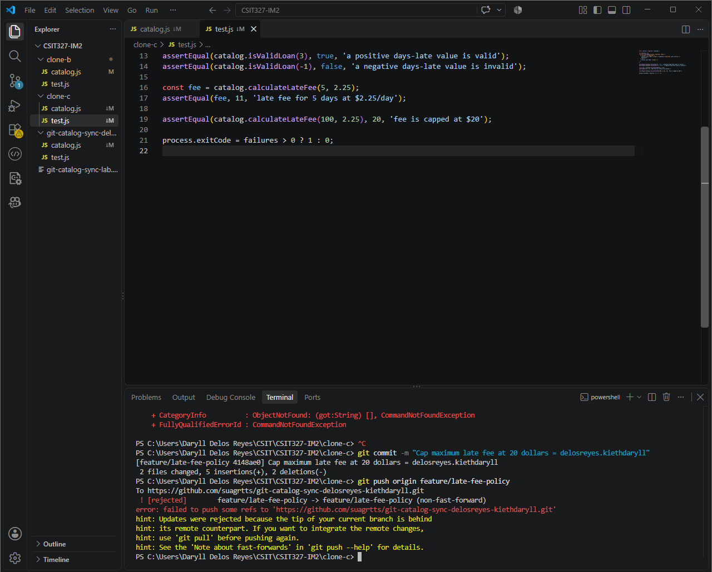
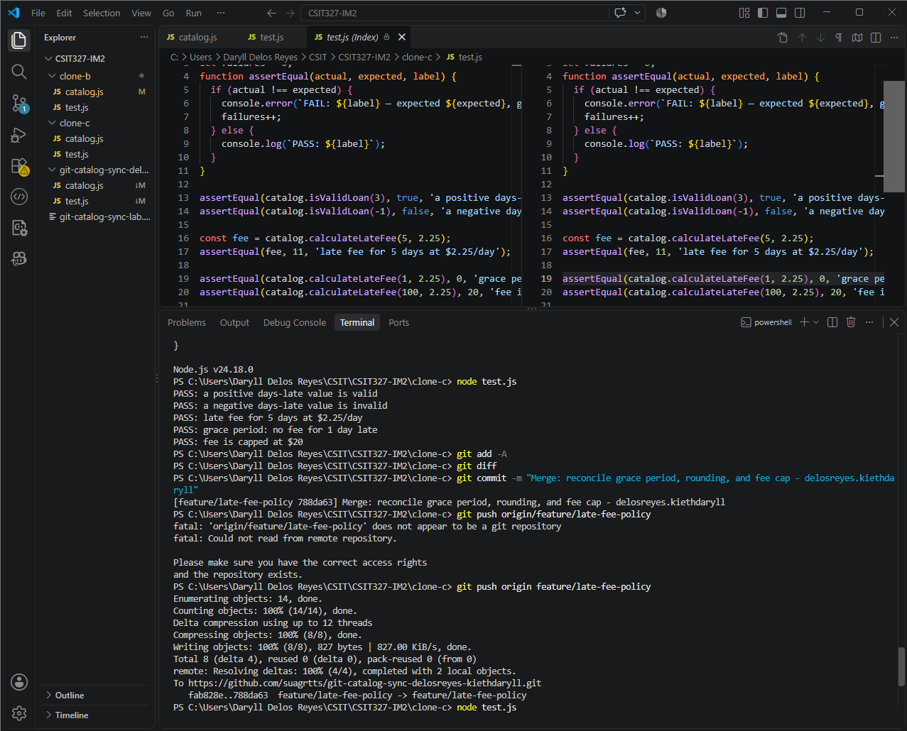
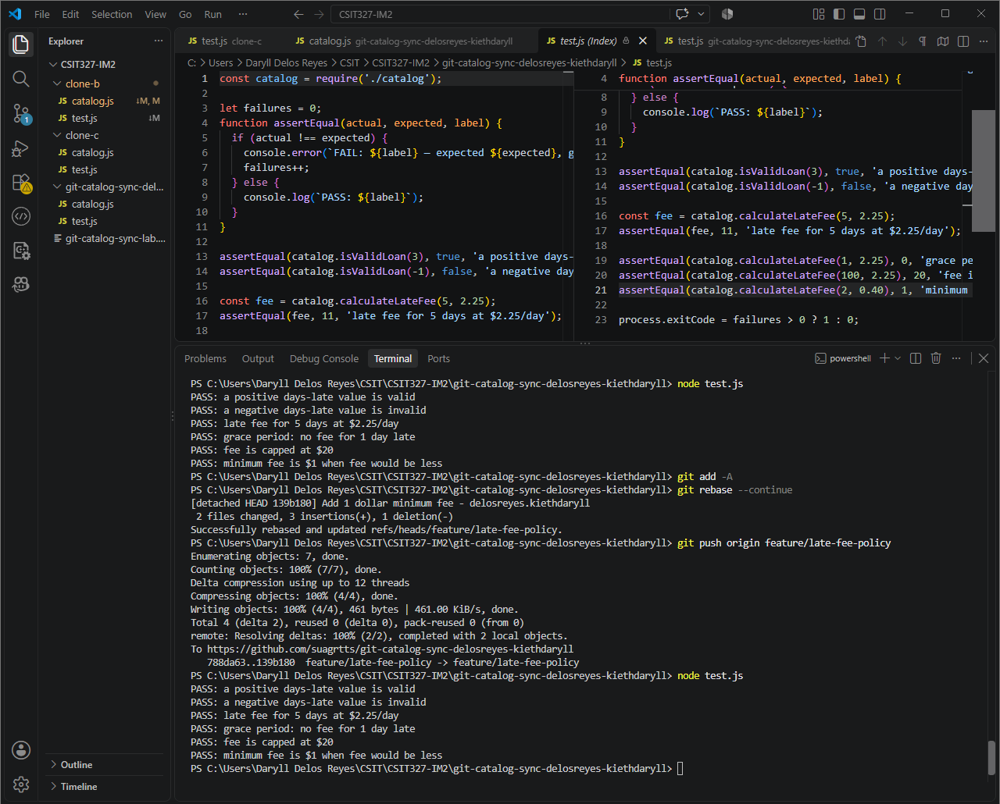
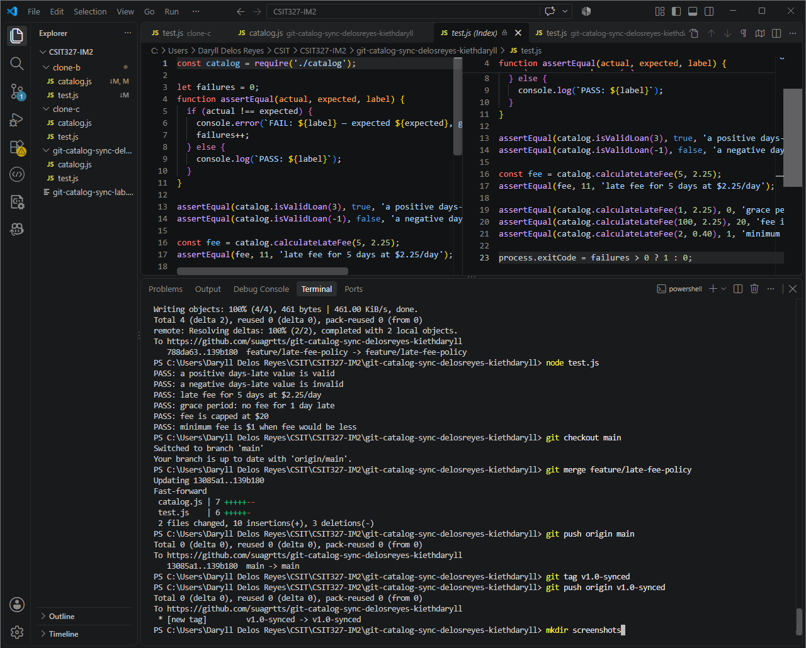

# WORKFLOW.md — Catalog Sync Lab

## Screenshots

### Task 1 — Grace period pushed from Clone A


### Task 2 — Clone B push rejected


### Task 3 — Merge resolved and pushed from Clone B


### Task 4 — Clone C push rejected


### Task 5 — Three-way merge resolved and pushed from Clone C


### Task 6 — Rebase resolved and pushed from Clone A


### Task 7 — Merged to main and tagged


---

## Question 1: Walk through the final `calculateLateFee` function

```js
function calculateLateFee(daysLate, ratePerDay) {
  if (daysLate <= 1) return 0;                    // Contributor A (Task 1) — 1-day grace period
  const fee = Math.round(daysLate * ratePerDay);   // Contributor B (Task 2) — rounding instead of truncating
  if (fee > 0 && fee < 1) return 1;                // Contributor A (Task 6) — $1 minimum fee
  return Math.min(fee, 20);                        // Contributor C (Task 4) — $20 maximum fee cap
}
```

- **Line 1 (`if daysLate <= 1`):** Contributor A added a grace period so that anyone who is only 1 day late (or less) pays nothing. This was the first change pushed in Task 1.
- **Line 2 (`Math.round`):** Contributor B changed the calculation from `Math.floor` (truncate) to `Math.round` (round to nearest integer), making the fee fairer when there are fractional cents.
- **Line 3 (`if fee > 0 && fee < 1`):** Contributor A came back in Task 6 and added a minimum fee rule — if the calculated fee is between $0 and $1 (exclusive), it gets bumped up to $1 so the library always collects something.
- **Line 4 (`Math.min(fee, 20)`):** Contributor C capped the maximum fee at $20 so borrowers are never charged an unreasonably large amount no matter how many days they are late.

## Question 2: Two-way conflict (Task 3) vs three-way conflict (Task 5)

In Task 3 the conflict was relatively straightforward — only two versions of the same function needed to be reconciled (Clone A's grace period line + Clone B's `Math.round`). Both changes touched the function body but in different ways, so combining them was a matter of keeping the grace period `if` statement and using `Math.round` on the return line.

In Task 5 the conflict was significantly harder because Clone C's version of the code was based on the **original** (neither grace period nor rounding existed in its view). When merging, I had to reconcile three completely independent changes into one coherent function:
- The grace period check at the top
- The rounding method in the calculation
- The fee cap wrapping the return value

This required understanding all three contributors' intentions simultaneously and restructuring the function so that the logic flows correctly (grace period → calculate with rounding → apply cap). With two contributors you're choosing between two alternatives; with three you're architecting a solution that satisfies everyone's intent at once.

## Question 3: Merge (Task 5) vs rebase (Task 6)

**Merge (Task 5):** Git created a new **merge commit** with two parents — my local work and the remote's history. Both branches of history are preserved in the commit graph. You can see exactly where the histories diverged and where they came back together. The conflict is resolved once in the merge commit.

**Rebase (Task 6):** Git took my local commits and **replayed** them one at a time on top of the remote's latest state. Each commit was rewritten as if I had written it after everyone else's work. This creates a **linear history** with no merge commit. However, I had to resolve conflicts at each replayed commit separately (not just once), which meant more individual conflict resolution steps. The advantage is a cleaner, easier-to-read commit log.

The key practical difference: merge preserves history as it actually happened (diverge then converge), while rebase rewrites history to look like sequential work. Both achieve the same end result in the code, but the commit graph looks different.

## Question 4: What process change would prevent all three rejected pushes?

**Pull (fetch + merge/rebase) before starting any new work.** If all three contributors had agreed on a simple rule — "always run `git pull` on the feature branch before you start coding" — none of the rejected pushes would have happened. Each person would have started with the latest version of the code and their changes would have been additive rather than divergent.

Even better: use **short-lived feature branches with pull requests**. Instead of everyone committing directly to `feature/late-fee-policy`, each contributor would create their own branch (e.g., `feature/grace-period`, `feature/round-fee`, `feature/fee-cap`), push it, and open a pull request. The team reviews and merges one at a time. This way conflicts are caught during code review and only one person has to resolve them at merge time, with the full context of both changes visible.